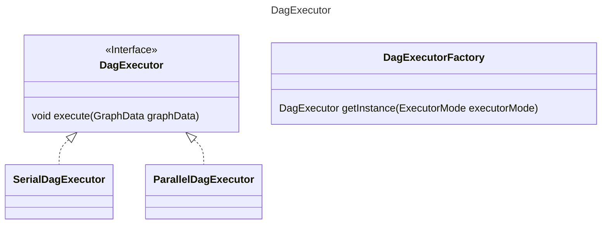
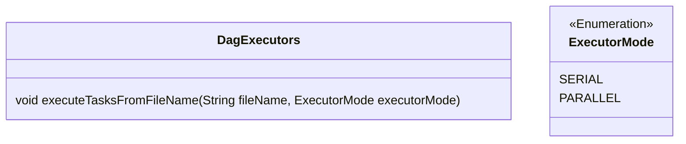
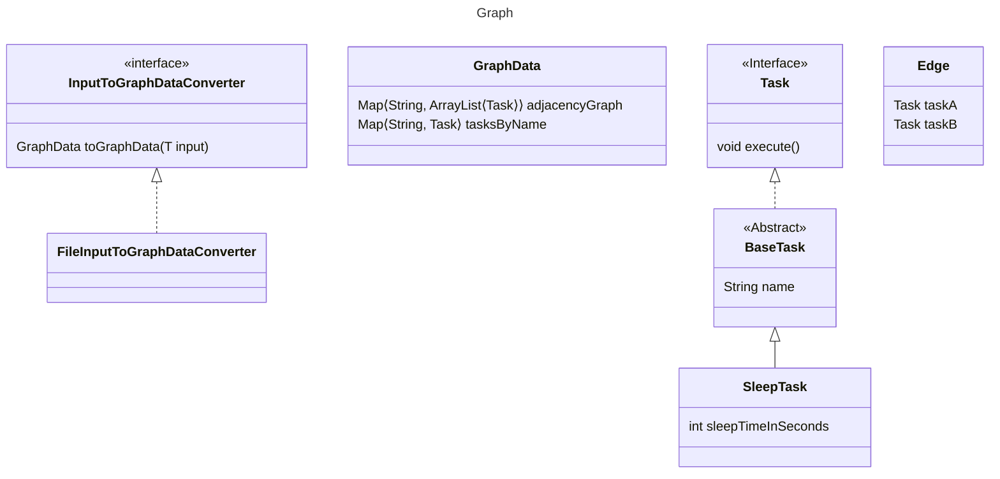

### Dag Tasks Executor

* Runs tasks as represented by a directed acyclic graph
* Mode of operation
    * Serial
    * Parallel

### Class Diagram

```mermaid
---
title: DagExecutor
---
classDiagram
	direction TB
	class DagExecutor {
		<<Interface>>
		void execute(GraphData graphData)
	}
	DagExecutor <|.. SerialDagExecutor
	DagExecutor <|.. ParallelDagExecutor
	class DagExecutorFactory {
		DagExecutor getInstance(ExecutorMode executorMode)
	}
```

```mermaid
classDiagram
	direction TB
	class DagExecutors {
		void executeTasksFromFileName(String fileName, ExecutorMode executorMode)
	}
	class ExecutorMode {
		<<Enumeration>>
		SERIAL
		PARALLEL
	}
```

```mermaid
---
title: Graph
---
classDiagram
	class InputToGraphDataConverter {
		<<interface>>
		GraphData toGraphData(T input)
	}
	InputToGraphDataConverter <|.. FileInputToGraphDataConverter
	class GraphData {
		Map⟨String, ArrayList⟨Task⟩⟩ adjacencyGraph
		Map⟨String, Task⟩ tasksByName
	}
	class Task {
		<<Interface>>
		void execute()
	}
	class BaseTask {
		<<Abstract>>
		String name
	}
	Task <|.. BaseTask
	class SleepTask {
		int sleepTimeInSeconds
	}
	BaseTask <|-- SleepTask
	class Edge {
		Task taskA
		Task taskB
	}
```
